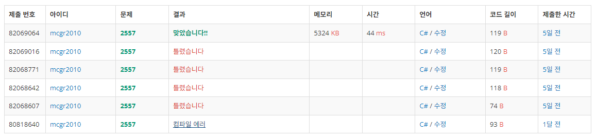

## 백준 > 01. 입출력과 사칙연산 > 01번. Hello World    
문제번호 [2557](https://www.acmicpc.net/problem/2557), &nbsp; 시간제한: 1초, &nbsp; 메모리제한: 128MB

### 목표
>string형 변수를 출력할 수 있다.

<br>

### 작성한 코드    

```cs
using System;

//Hello World!를 출력하시오.

class Program
{
    static void Main(string[] args)
    {
        Console.Write("Hello World!"); //띄어쓰기, 쉼표 주의!
    }
    
}
```

<br>

### 결과    
: C# 코드의 기본 구성(전처리기 지시문)을 제대로 적어주지 못해서 오답이 나왔다.


