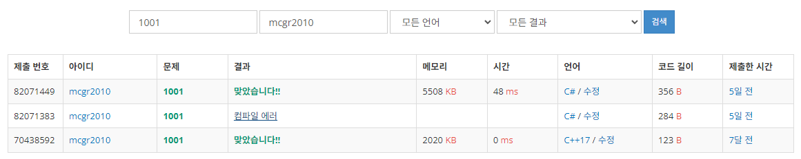

## 백준 > 01. 입출력과 사칙연산 > 03번. A-B    
문제번호: [1001](https://www.acmicpc.net/problem/1001), &nbsp; 시간제한: 2초, &nbsp; 메모리제한: 128MB

### 목표
>string형 변수를 배열로 입력받아 Split()함수로 구분해 사용할 수 있다.    
>정수의 차 계산을 할 수 있다.

<br>

### 작성한 코드   

```cs
using System;

// 두 정수 A와 B를 입력받은 다음, A-B를 출력하는 프로그램을 작성하시오.

class Program
{    
    static void Main(string[] args)
    {    
        // 배열에 Split() --> 띄어쓰기 무시, 띄어쓰기 단위로 끊어서 배열에 담아줌
        string[] str = Console.ReadLine().Split(); // A B

        int A = int.Parse(str[0]);
        int B = int.Parse(str[1]);

        Console.Write(A + B); // A-B

    }    
    
}
```

<br>

### 결과    
: 통합 개발환경(IDE, VS 이용) 없이 코딩을 시도하여, 오류가 났음에도 알아보지 못해 컴파일 에러가 났다.

