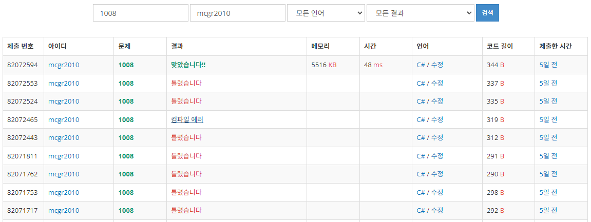

## 백준 > 01. 입출력과 사칙연산 > 05번. A/B  &nbsp;`[스페셜 저지 문제]`   
문제번호: [1008](https://www.acmicpc.net/problem/1008), &nbsp; 시간제한: 2초, &nbsp; 메모리제한: 128MB

### 목표
>string형 변수를 배열로 입력받아 Split()함수로 구분해 사용할 수 있다.    
>정수를 입력받아 나눗셈 한 결과를 실수로 형변환 하여 출력할 수 있다.

<br>

### 작성한 코드   

```cs
using System;

// 두 정수 A와 B를 입력받은 다음, A*B를 출력하는 프로그램을 작성하시오.
// 첫째 줄에 A/B를 출력한다. 실제 정답과 출력값의 절대오차 또는 상대오차가 10^-9 이하이면 정답이다.
// 10-9 이하의 오차를 허용한다는 말은 꼭 소수 9번째 자리까지만 출력하라는 뜻이 아니다.

class Program
{
    static void Main(string[] args)
    {
        // 배열에 Split() --> 띄어쓰기 무시, 띄어쓰기 단위로 끊어서 배열에 담아줌
        string[] str = Console.ReadLine().Split(); // A B

        int A = int.Parse(str[0]);
        int B = int.Parse(str[1]);
        double result = (double)A / (double)B;             

        Console.Write(result); // A/B

    }    
    
}
```

<br>

### 결과    
: 정수를 실수으로 형변환하는 과정에서 float형으로 시도해 보았으나, 범위 초과로 오답이 나왔다.

