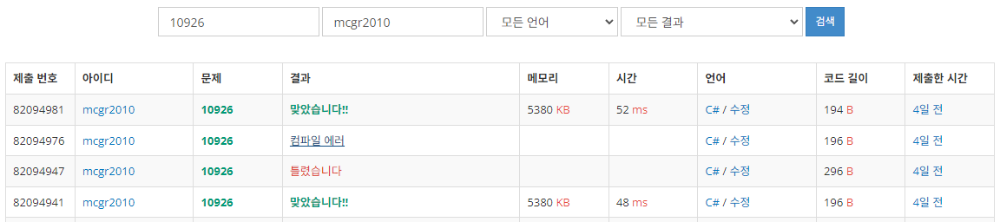

## 백준 > 01. 입출력과 사칙연산 > 07번. ??!    
문제번호: [10926](https://www.acmicpc.net/problem/10926), &nbsp; 시간제한: 1초, &nbsp; 메모리제한: 256MB

### 목표
>문자열간에 +키워드를 이용해서 문자열의 덧셈을 시도할 수 있다.    
>문자열 앞에 $키워드를 이용해서 문자열의 덧셈을 시도할 수 있다.    

<br>

### 작성한 코드   

```cs
// 준하는 사이트에 회원가입을 하다가 joonas라는 아이디가 이미 존재하는 것을 보고 놀랐다. 준하는 놀람을 ??!로 표현한다. 
// 준하가 가입하려고 하는 사이트에 이미 존재하는 아이디가 주어졌을 때, 놀람을 표현하는 프로그램을 작성하시오.

using System;

class Program
{
    static void Main(string[] args)
    {
        // if문으로 중복일 경우와 아닌 경우를 나누어 처리하려고 시도했으나,
        // 문제에서는 아이디가 이미 중복일 경우만 가정하고 있었다.
        string input = Console.ReadLine();
        Console.WriteLine($"{input}??!");
        //Console.WriteLine(input+"??!"); //이 또한 위의 내용과 동일하게 정답처리된다.

    }    
    
}
```

<br>

### 결과    
: 중복여부를 판단해서 처리하려고 시도했으나, 문제는 이미 중복을 가정한 경우여서 오답이 나왔다.

