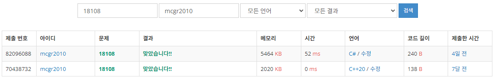

## 백준 > 01. 입출력과 사칙연산 > 08번. 1998년생인 내가 태국에서는 2541년생?!    
문제번호: [18108](https://www.acmicpc.net/problem/18108), &nbsp; 시간제한: 1초 (추가 시간 없음), &nbsp; 메모리제한: 1024MB

### 목표
>string으로 받은 값을 Parse(), TryParse()를 통해 다른 타입으로 변환할 수 있다.      
>불기↔서기 연도변환, 섭씨↔화씨 온도변환 등을 연산할 수 있다.     

<br>

### 작성한 코드   

```cs
// 불기 연도를 서기 연도로 변환한 결과를 출력한다.

using System;

class Program
{
    static void Main(string[] args)
    {
        // 입력받은 string값을 int로 변환해준다.
        int nBYear = int.Parse(Console.ReadLine());
        
        // 적절한 계산을 거친 뒤 출력한다.
        int nSYead = nBYear - 543;
        
        Console.Write(nSYead);

    }
    
    
}
```

<br>

### 결과    
