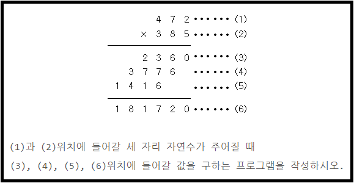
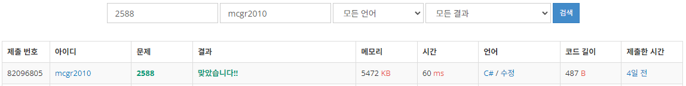

## 백준 > 01. 입출력과 사칙연산 > 10번. 곱셈    
문제번호: [2588](https://www.acmicpc.net/problem/2588), &nbsp; 시간제한: 1초, &nbsp; 메모리제한: 128MB

### 목표     
>조건에 부합하는 계산식을 작성할 수 있다.     

### 예시    


<br>

### 작성한 코드   

```cs
// 예시 이미지 속 곱셈의 계산순서를 연출해본다.    

using System;

class Program
{
    static void Main(string[] args)
    {        
        // 3
        int num1 = int.Parse(Console.ReadLine());
        int num2 = int.Parse(Console.ReadLine());
        
        int A = num1 * (num2 % 10);
        int B = num1 * ((num2 / 10) % 10);
        int C = num1 * (num2 / 100);
        int D = A + (B*10) + (C*100);
        
        Console.WriteLine(A);
        Console.WriteLine(B);
        Console.WriteLine(C);
        Console.WriteLine(D);

    }
    
    
}
```

<br>

### 결과    

