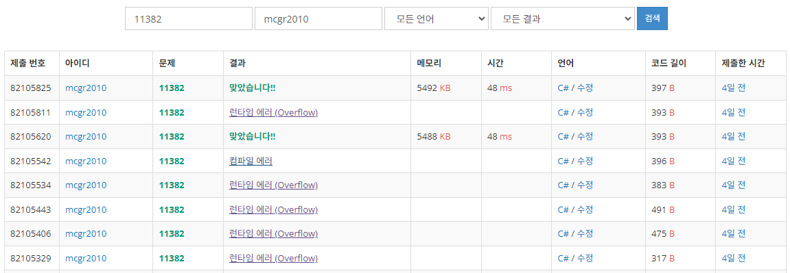

## 백준 > 01. 입출력과 사칙연산 > 11번. 꼬마 정민    
문제번호: [11382](https://www.acmicpc.net/problem/11382), &nbsp; 시간제한: 1초, &nbsp; 메모리제한: 512MB

### 목표     
>정수형 변수의 종류를 알고 알맞은 상황에 사용할 수 있다.    
>참고: [마이크로소프트 C# 가이드: 정수 숫자 형식](https://learn.microsoft.com/ko-kr/dotnet/csharp/language-reference/builtin-types/integral-numeric-types)

<br>

### 작성한 코드   

```cs
//  A + B + C를 계산한다. 이때, A, B, C의 범위는 모두 (1 ≤ A, B, C ≤ 10^12)이다.

using System;

class Program
{
    static void Main(string[] args)
    {        
        // 제시된 수의 범위가 모두 1 ~ 1조 (1,000,000,000,000) 이므로, 
        // 세 수를 단순히 int로 선언하면 Overflow가 일어날 수 있다.
        // 위 상황의 경우 long이나 ulong이 적합하다는 것을 깨달았다.

        string[] str = Console.ReadLine().Split();        

        long result = 0;
        result += long.Parse(str[0]);
        result += long.Parse(str[1]);
        result += long.Parse(str[2]);

        Console.Write(result);

    }
    
    
}
```

<br>

### 결과    
: 입력되는 수의 범위를 확인하지 못해서 오답이 나왔다. 각각 long, ulong이 정답 판정인것을 확인했다.

