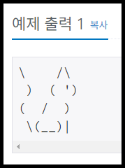
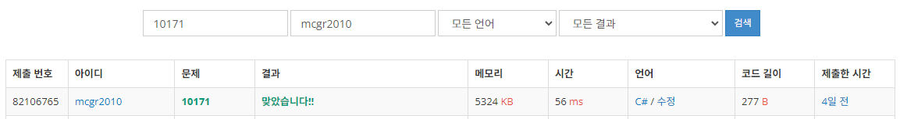

## 백준 > 01. 입출력과 사칙연산 > 12번. 고양이  &nbsp;`(다국어 문제)`  
문제번호: [10171](https://www.acmicpc.net/problem/10171), &nbsp; 시간제한: 1초, &nbsp; 메모리제한: 256MB

### 목표     
>이스케이프 시퀀스의 종류를 알고 활용할 수 있다.    
>참고: [마이크로소프트 C# 가이드: 이스케이프 시퀀스](https://learn.microsoft.com/ko-kr/cpp/c-language/escape-sequences?view=msvc-170)

### 예시    


<br>

### 작성한 코드   

```cs
// 이미지 속 고양이 코드를 작성해본다.    

using System;

class Program
{
    static void Main(string[] args)
    {   
        // 먀옹     
        Console.WriteLine("\\    /\\");
        Console.WriteLine(" )  ( \')");
        Console.WriteLine("(  /  )");
        Console.WriteLine(" \\(__)|");

    }   
    
}
```
<br>

### 결과    


