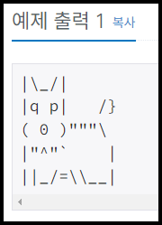
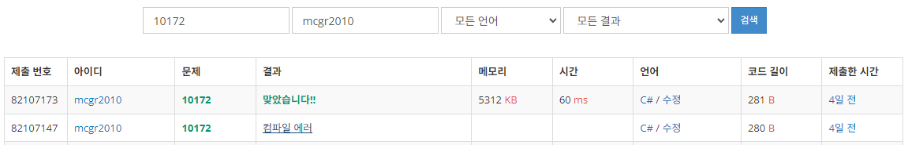

## 백준 > 01. 입출력과 사칙연산 > 13번. 개    
문제번호: [10172](https://www.acmicpc.net/problem/10172), &nbsp; 시간제한: 1초, &nbsp; 메모리제한: 256MB

### 목표     
>이스케이프 시퀀스의 종류를 알고 활용할 수 있다.    
>참고: [마이크로소프트 C# 가이드: 이스케이프 시퀀스](https://learn.microsoft.com/ko-kr/cpp/c-language/escape-sequences?view=msvc-170)

### 예시    

<br>

### 작성한 코드   

```cs
// 이미지 속 강아지 코드를 작성해본다.    

using System;

class Program
{
    static void Main(string[] args)
    {   
        // 왕왕     
        Console.WriteLine("|\\_/|");
        Console.WriteLine("|q p|   /}");
        Console.WriteLine("( 0 )\"\"\"\\");
        Console.WriteLine("|\"^\"`    |");
        Console.WriteLine("||_/=\\\\__|");        

    }    
    
}
```
<br>

### 결과    
: 중간끝에 세미콜론을 깜빡해서 오류가 났다.    

