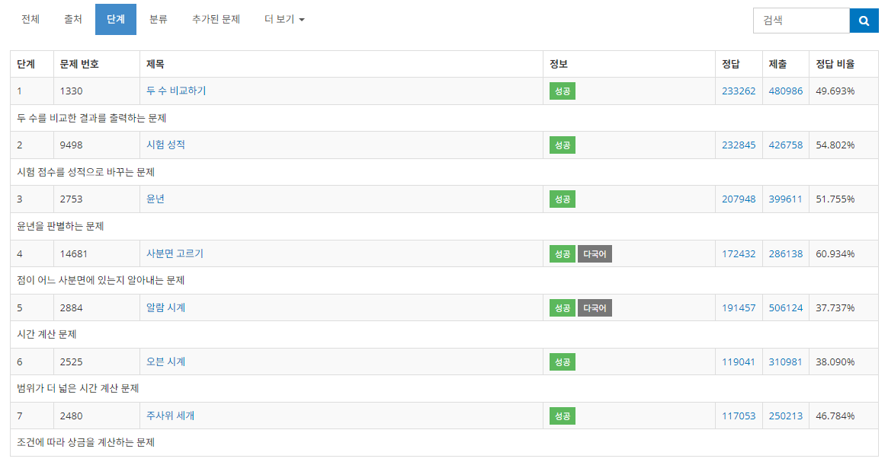

## 백준 > 02. 조건문 > [목록 (바로가기)](https://www.acmicpc.net/step/4)

### 목표     
> 조건문에 대해 학습한다.    
> if + else문, &nbsp; if + if else + else문, &nbsp; if + if문을 상황에 맞게 사용할 수 있다.    

 

### 목차 

   

[01. 두 수 비교하기](https://github.com/tjsp9830/Baekjoon/blob/main/02/01.%20%EB%91%90%20%EC%88%98%20%EB%B9%84%EA%B5%90%ED%95%98%EA%B8%B0.md)
 
[02. 시험 성적](https://github.com/tjsp9830/Baekjoon/blob/main/02/02.%20%EC%8B%9C%ED%97%98%20%EC%84%B1%EC%A0%81.md)
 
[03. 윤년](https://github.com/tjsp9830/Baekjoon/blob/main/02/03.%20%EC%9C%A4%EB%85%84.md)
 
[04. 사분면 고르기](https://github.com/tjsp9830/Baekjoon/blob/main/02/04.%20%EC%82%AC%EB%B6%84%EB%A9%B4%20%EA%B3%A0%EB%A5%B4%EA%B8%B0.md)
 
[05. 알람 시계](https://github.com/tjsp9830/Baekjoon/blob/main/02/05.%20%EC%95%8C%EB%9E%8C%20%EC%8B%9C%EA%B3%84.md)
 
[06. 오븐 시계](https://github.com/tjsp9830/Baekjoon/blob/main/02/06.%20%EC%98%A4%EB%B8%90%20%EC%8B%9C%EA%B3%84.md)
 
[07. 주사위 세개](https://github.com/tjsp9830/Baekjoon/blob/main/02/07.%20%EC%A3%BC%EC%82%AC%EC%9C%84%20%EC%84%B8%EA%B0%9C.md)
 

[> 돌아가기](https://github.com/tjsp9830/Baekjoon/tree/main/02)
 

