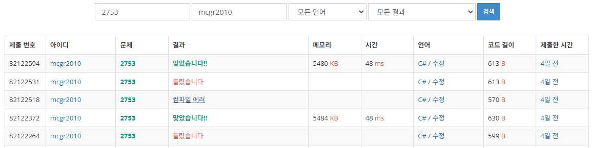

## 백준 > 02. 조건문 > 03번. 윤년    
문제번호: [2753](https://www.acmicpc.net/problem/2753), &nbsp; 시간제한: 1초, &nbsp; 메모리제한: 128MB

### 목표     
> if문과 if else문을 상황에 맞게 사용할 수 있다.    
> 문제의 의도를 정확히 파악 한 뒤 코드를 작성한다.    

<br>

### 작성한 코드   

```cs
// 연도가 주어졌을 때, 윤년이면 1, 아니면 0을 출력하는 프로그램을 작성하시오.
// 윤년은 연도가 4의 배수이면서, 100의 배수가 아닐 때 또는 400의 배수일 때이다.
// 범위: 연도는 1보다 크거나 같고, 4000보다 작거나 같은 자연수이다.

using System;

class Program
{
    static void Main(string[] args)
    {        
        int year = int.Parse(Console.ReadLine());

        // 코딩에 앞서, 문제나 지시사항을 정확히 파악해야 한다.
        
        // 본인이 처음에 이해한 지시사항은 다음과 같았다.
        //if(year % 4 == 0)
        //{
        //    if (year % 100 != 0 || year % 400 == 0)
        //        Console.Write("1");
        //}   
        //else
        //    Console.Write("0");

        // 하지만 문제에서 요구한 내용은 다음과 같았다.
        if (year % 4 == 0 && year % 100 != 0)
            Console.Write("1");
        else if(year % 400 == 0)
            Console.Write("1");
        else
            Console.Write("0");

    }    
    
}
```

<br>

### 결과    
: 문제에서 요구한 내용을 한번에 이해하지 못해서 제출을 여러번 시도하였다.

