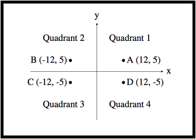
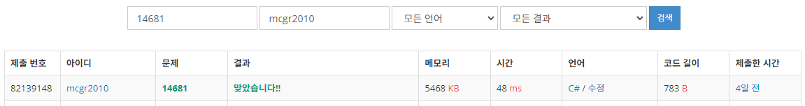

## 백준 > 02. 조건문 > 04번. 사분면 고르기  &nbsp;`(다국어 문제)`   
문제번호: [14681](https://www.acmicpc.net/problem/14681), &nbsp; 시간제한: 1초, &nbsp; 메모리제한: 512MB

### 목표     
> if문과 if else문을 상황에 맞게 사용할 수 있다.    
> 제 4사분면을 나타내는 원리를 적용할 수 있는 예시를 조사해본다.

### 예시    

<br>

### 작성한 코드   

```cs
// 흔한 수학 문제 중 하나는 주어진 점이 어느 사분면에 속하는지 알아내는 것이다. 
// 사분면은 아래 그림처럼 1부터 4까지 번호를 갖는다. "Quadrant n"은 "제n사분면"이라는 뜻이다.
// 제 1사분면: +, +
// 제 2사분면: -, +
// 제 3사분면: -, -
// 제 4사분면: +, -

using System;

class Program
{
    static void Main(string[] args)
    {        
        int X = int.Parse(Console.ReadLine());        
        int Y = int.Parse(Console.ReadLine());
        
        if(X>0 && Y>0)
            Console.Write("1");
        else if(X<0 && Y>0)
            Console.Write("2");
        else if(X<0 && Y<0)
            Console.Write("3");
        else if(X>0 && Y<0)
            Console.Write("4");

    }    
    
}
```

<br>

### 결과    


