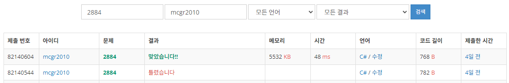

## 백준 > 02. 조건문 > 05번. 알람 시계  &nbsp;`(다국어 문제)`    
문제번호: [2884](https://www.acmicpc.net/problem/2884), &nbsp; 시간제한: 1초, &nbsp; 메모리제한: 128MB

### 목표     
> if문과 if else문, if문과 또 다른 if문을 상황에 맞게 사용할 수 있다.    
> 시간 계산에 대한 코드 작성을 시도해본다. (상수 뺄셈)

<br>

### 작성한 코드   

```cs
//첫째 줄에 두 정수 H와 M이 주어진다. (0 ≤ H ≤ 23,  0 ≤ M ≤ 59)    
//입력받은 시간보다 45분을 이르게 출력해준다.
//입력 시간은 24시간 표현을 사용한다. (하루의 시작은 0:0(자정)이고, 끝은 23:59(다음날 자정 1분 전)이다.)
//시간을 나타낼 때, 불필요한 0은 사용하지 않는다.

using System;

class Program
{
    static void Main(string[] args)
    {        
        string[] str = Console.ReadLine().Split();

        int nHour = int.Parse(str[0]);
        int nMinute = int.Parse(str[1]);

        // 현재 시각의 분침이 45 미만이라면, 
        // 45분을 되돌렸을때 시간이 -1 되고, 분은 +15 된다는 점을 이용해서 코드를 단순화 했다.
        if (nMinute < 45)
        {
            nHour -= 1;
            nMinute += 15;

        }
        else
        {   
            // 현재 시각의 분이 45분 이상이라면 단순히 분침에서 45를 빼주었다.
            nMinute -= 45;
        }

        // 이때, 시각의 시침에 대해서 예외처리를 해준다.
        // 분침이 45 미만이어서 시침에서 1을 빼준 결과가 -1이라면, 기존 시침은 0시였을 것이므로 23으로 바꾸어준다.
        if(nHour == -1)
        {
            nHour = 23;
        }

        Console.WriteLine($"{nHour} {nMinute}");

    }    
    
}
```

<br>

### 결과    
: 시각의 예외처리에서 논리에 오류가 있어 오답이 나왔다.

