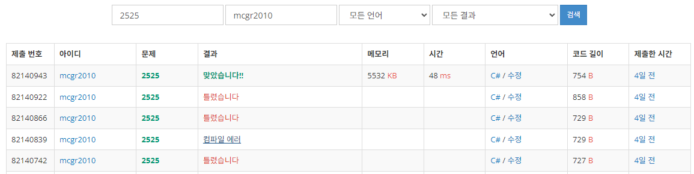

## 백준 > 02. 조건문 > 06번. 오븐 시계    
문제번호: [2525](https://www.acmicpc.net/problem/2525), &nbsp; 시간제한: 1초, &nbsp; 메모리제한: 128MB

### 목표     
> if문과 if else문, if문과 또 다른 if문을 상황에 맞게 사용할 수 있다.    
> 시간 계산에 대한 코드 작성을 시도해본다. (변수 덧셈)

<br>

### 작성한 코드   

```cs
// 첫째 줄에는 현재 시각이 나온다. 
// 현재 시각은 시 A (0 ≤ A ≤ 23) 와 분 B (0 ≤ B ≤ 59)가 정수로 빈칸을 사이에 두고 순서대로 주어진다. 
// 두 번째 줄에는 요리하는 데 필요한 시간 C (0 ≤ C ≤ 1,000)가 분 단위로 주어진다.

using System;

class Program
{
    static void Main(string[] args)
    {        
        string[] str = Console.ReadLine().Split();

        int nHour = int.Parse(str[0]);
        int nMinute = int.Parse(str[1]);

        int nAfter = int.Parse(Console.ReadLine());

        // 작동 시간으로 받은 정수형 변수를 60으로 나눈 값과, 그의 나머지를 구한다.
        // 그 값을 각각 시침과 분침에 더해준다.
        nHour += (nAfter / 60);
        nMinute += (nAfter % 60);

        // 분침이 60을 넘어갈 때의 예외처리를 해준다.
        if (nMinute >= 60)
        {
            nHour += 1;
            nMinute -= 60;
        }

        // 시침이 24를 넘어갈 때의 예외처리를 해준다.
        if (nHour >= 24)
            nHour -= 24;

        // 출력
        Console.WriteLine($"{nHour} {nMinute}");

    }    
    
}
```

<br>

### 결과    
: 논리에 맞게 구현하는데에 시행착오가 있어 오답이 나왔다.

