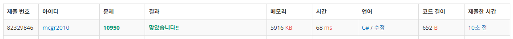

## 백준 > 03. 반복문 > 02번. A+B - 3    
문제번호: [10950](https://www.acmicpc.net/problem/10950), &nbsp; 시간제한: 1초, &nbsp; 메모리제한: 256MB

### 목표     
> for문과 다른 기능을 연계하여 사용할 수 있다.  
> 문제의 의도에 맞게 for문의 조건식을 채울 수 있다.

<br>

### 작성한 코드   

```cs
// 두 정수 A와 B를 입력받은 다음, A+B를 출력하는 프로그램을 작성하시오.
// 첫째 줄에 테스트 케이스의 개수 T가 주어지고, 다음 줄부터 각 줄에 A와 B가 주어진다.

using System;

class Program
{
    static void Main(string[] args)
    {        
        int testCase = int.Parse(Console.ReadLine());
        
        for(int i=0; i<testCase; i++)
        {
            string[] stTestCase = Console.ReadLine().Split();            
            int A = int.Parse(stTestCase[0]);
            int B = int.Parse(stTestCase[1]);

            Console.WriteLine($"{A + B}");
        }

    }
    
}
```

<br>

### 결과    

