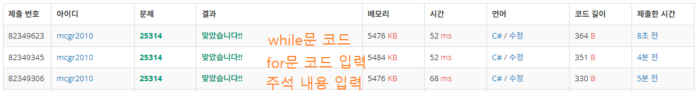

## 백준 > 03. 반복문 > 05번. 구구단    
문제번호: [25314](https://www.acmicpc.net/problem/25314), &nbsp; 시간제한: 0.5초 (추가 시간 없음), &nbsp; 메모리제한: 128MB (추가 메모리 없음)

### 목표     
> 문제에서 요구하는 사항을 반복문으로 나타낼 수 있다.    

<br>

### 작성한 코드   

```cs
// 4의 배수인 정수 n이 주어질때, long이 몇 번 반복되는지 출력하라.

using System;

class Program
{
    static void Main(string[] args)
    {        
        int num = int.Parse(Console.ReadLine());
        int result = num / 4;

        // for문으로 구현하기
        //for (int i = 0; i < num/4; i++)
        for (int i = 0; i < result; i++)
            Console.Write("long ");            

        // while문으로 구현하기
        while (result != 0)
        {
            Console.Write("long ");
            result -= 1;
        }            

        Console.Write("int");
    }
    
}
```

<br>

### 결과    
: 주석 안의 내용(25번째 줄)처럼 입력할 경우, 나누기 연산이 실행이 가미되어 비교적 느렸다.

