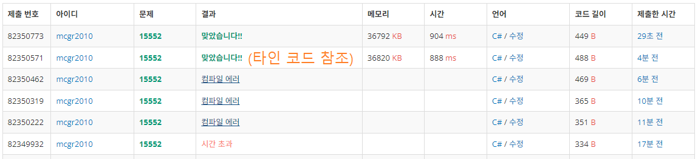

## 백준 > 03. 반복문 > 06번. 빠른 A+B    
문제번호: [15552](https://www.acmicpc.net/problem/15552), &nbsp; 시간제한: 1초, &nbsp; 메모리제한: 512MB

### 목표     
> string의 불변성에 대해 학습하고, 스트링 빌더를 이용해본다.    

<br>

### 작성한 코드   

```cs
// tring을 사용해서 출력을 시도하면,
// string 불변성에 의해 처리 속도가 느려지므로 시간 초과가 발생하는 문제이다.
// 따라서 StringBuilder와 입력시 Append(), 출력시 ToString()을 이용했다.

using System;

class Program
{
    static void Main(string[] args)
    {        
        int time = Convert.ToInt32(Console.ReadLine());
        StringBuilder strb = new StringBuilder();

        for (int i = 0; i < time; i++)
        {
            string[] str = Console.ReadLine().Split();
            int a = Convert.ToInt32(str[0]);
            int b = Convert.ToInt32(str[1]);

            // 스트링 빌더에 Append()를 이용해서 "A+B \n"을 한줄씩 담아둔다.
            strb.Append(a + b + "\n");
        }

        // 스트링빌더에 저장된 내용을 ToString()으로 출력한다.
        Console.WriteLine(strb.ToString());
    }
    
}
```

<br>

### 결과    
: string으로 입/출력을 시도하니 시간 초과가 나왔다. [검색](https://coding-of-today.tistory.com/81)을 통해 스트링 빌더를 이용하여 해결하였다.

