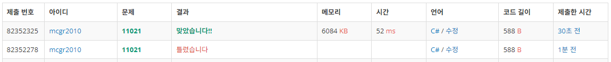

## 백준 > 03. 반복문 > 07번. A+B - 7    
문제번호: [11021](https://www.acmicpc.net/problem/11021), &nbsp; 시간제한: 1초, &nbsp; 메모리제한: 256MB

### 목표     
> 문제에 맞는 반복문, 사칙연산, 입출력을 수행한다.    

<br>

### 작성한 코드   

```cs
// 첫째 줄에 테스트 케이스의 개수 T, 다음 줄부터 한 줄로 A와 B가 주어진다.
// 각 줄마다 "Case #x: "과 A+B를 출력한다. 테스트 케이스 번호는 1부터 시작한다.

using System;

class Program
{
    static void Main(string[] args)
    {        
        int testCase = int.Parse(Console.ReadLine());

        for(int i=0; i<testCase; i++)
        {
            string[] str = Console.ReadLine().Split();
            int A = int.Parse(str[0]);
            int B = int.Parse(str[1]);

            Console.WriteLine($"Case #{i+1}: {A+B}");
        }

    }
    
}
```

<br>

### 결과    
: i+1을 해야 하는 공간에 i++을 집어넣어 연산에 오류가 생겼다.

