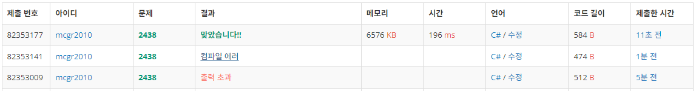

## 백준 > 03. 반복문 > 09번. 별 찍기 - 1    
문제번호: [2438](https://www.acmicpc.net/problem/2438), &nbsp; 시간제한: 1초, &nbsp; 메모리제한: 128MB

### 목표     
> 이중 for문을 이용해 별찍기를 구현해본다.    

<br>

### 작성한 코드   

```cs
// 첫째 줄에는 별 1개, 둘째 줄에는 별 2개, N번째 줄에는 별 N개를 찍는 문제
// 첫째 줄에 주어진 N(1 ≤ N ≤ 100)의 갯수만큼 첫째 줄부터 N번째 줄까지 차례대로 별을 출력한다.

using System;

class Program
{
    static void Main(string[] args)
    {        
        int testCase = int.Parse(Console.ReadLine());

        for (int i = 1; i <= testCase; i++)
        {
            for (int j = 0; j < i; j++)
            {
                Console.Write("*");
            }

            Console.WriteLine("");
        }
        

    }
    
}
```

<br>

### 결과    
: 이중 for문의 초기화식 오류로 출력초과가 나왔고, IDE에서 옮겨오는 과정에서의 실수로 컴파일 에러가 났다.

