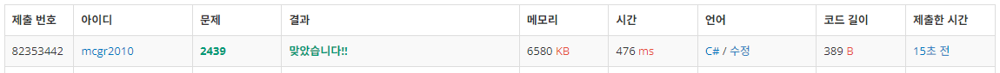

## 백준 > 03. 반복문 > 10번. 별 찍기 - 2    
문제번호: [2439](https://www.acmicpc.net/problem/2439), &nbsp; 시간제한: 1초, &nbsp; 메모리제한: 128MB

### 목표     
> 이중 for문을 이용해 여러가지 별찍기를 구현해본다.        

<br>

### 작성한 코드   

```cs
// 이전 문제의 좌우반전 형태를 출력하는 문제
// 첫째 줄에 주어진 N(1 ≤ N ≤ 100)의 갯수만큼 첫째 줄부터 N번째 줄까지 차례대로 별을 출력한다.


using System;

class Program
{
    static void Main(string[] args)
    {        
        int testCase = int.Parse(Console.ReadLine());

        for (int i = 1; i <= testCase; i++)
        {
            for (int k = 0; k < testCase - i; k++)
            {
                Console.Write(" ");
            }
            for (int j = 0; j < i; j++)
            {
                Console.Write("*");
            }

            Console.WriteLine("");
        }

    }
    
}
```

<br>

### 결과    

