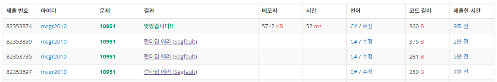

## 백준 > 03. 반복문 > 12번. A+B - 4    
문제번호: [10951](https://www.acmicpc.net/problem/10951), &nbsp; 시간제한: 1초, &nbsp; 메모리제한: 256MB

### 목표     
> while문의 반복에서 멈추는 시점이 없을때 예외처리에 주의한다.   

<br>

### 작성한 코드   

```cs
//끊임없이 정수 A와 B를 입력받아 합을 출력한다.     

using System;

class Program
{
    static void Main(string[] args)
    {        

        while (true)
        {
            // 문자열을 먼저 입력받고, Split()은 나중에 시도한다.
            string str = Console.ReadLine();

            // 먼저 입력받은 문자열이 null인지를 먼저 검사한다. (예외처리)
            if (str == null)
                break;  // null일경우 whlie문을 탈출한다.
            
            // 예외가 없을경우 계산을 이어나간다.
            string[] strs = str.Split();
            int A = int.Parse(strs[0]);
            int B = int.Parse(strs[1]);

            //출력
            Console.WriteLine($"{A + B}");

            //이하 반복됨                        
        }


    }
    
}
```

<br>

### 결과    
: null 예외처리에 실패해서 런타임 에러가 났다. &nbsp; [▷ 도움받은 자료](https://heesun9113.tistory.com/105)

