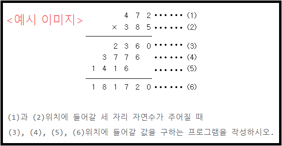
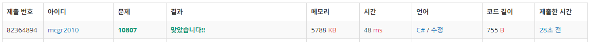

## 백준 > 04. 1차원 배열 > 01번. 개수 세기    
문제번호: [10807](https://www.acmicpc.net/problem/10807), &nbsp; 시간제한: 1초, &nbsp; 메모리제한: 256MB

### 목표     
> 1    

### 예시


<br>

### 작성한 코드   

```cs
// 2

using System;

class Program
{
    static void Main(string[] args)
    {        
        // 3

    }
    
}
```

<br>

### 결과    

