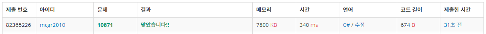

## 백준 > 04. 1차원 배열 > 02번. X보다 작은 수    
문제번호: [10871](https://www.acmicpc.net/problem/10871), &nbsp; 시간제한: 1초, &nbsp; 메모리제한: 256MB

### 목표     
> 배열을 선언하여 문제의 요구대로 코드를 작성할 수 있다.      

<br>

### 작성한 코드   

```cs
// 첫째 줄에 N과 X가 주어진다. 둘째 줄에 수열 A를 이루는 정수 N개가 주어진다.
// 정수 N개로 이루어진 수열 A와 정수 X가 주어진다. 이때, A에서 X보다 작은 수를 모두 출력하시오.

using System;

class Program
{
    static void Main(string[] args)
    {        
        // 첫째줄 입력받기
        string[] str = Console.ReadLine().Split();
        int N = int.Parse(str[0]);
        int X = int.Parse(str[1]);

        // 둘째줄 입력받기
        str = Console.ReadLine().Split();
        int[] A = new int[N];

        for (int i = 0; i < N; i++)
        {
            A[i] = int.Parse(str[i]);

            if (A[i] < X)
                Console.Write($"{A[i]} ");
        }

    }
    
}
```

<br>

### 결과    

