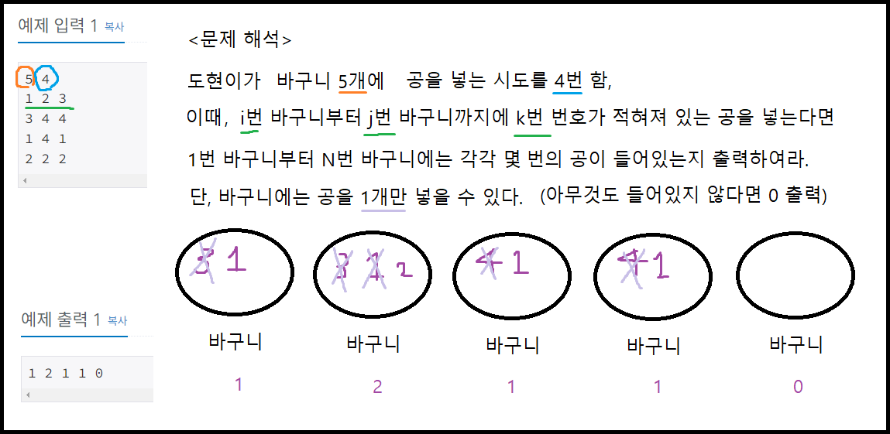

## 백준 > 04. 1차원 배열 > 05번. 공 넣기    
문제번호: [10810](https://www.acmicpc.net/problem/10810), &nbsp; 시간제한: 1초, &nbsp; 메모리제한: 256MB    

### 목표     
> 문제에서 의도하는 점을 잘 이해하고 코드를 작성할 수 있다.   
> 배열의 구현 의도에 따라서 for문과 foreach문을 적절히 선택하여 사용할 수 있다.    

### 예시


<br>

### 작성한 코드   

```cs
// 첫째 줄에 N (1 ≤ N ≤ 100)과  M (1 ≤ M ≤ 100)이 주어진다.
// 둘째 줄부터 M개의 줄에 걸쳐서 공을 넣는 방법이 주어진다.
// 공을 어떻게 넣을지가 주어졌을 때, M번 공을 넣은 이후에 각 바구니에 어떤 공이 들어 있는지 구하는 프로그램을 작성하시오.

// 각 방법은 세 정수 i, j, k로 이루어져 있으며, i번 바구니부터 j번 바구니까지에 k번 번호가 적혀져 있는 공을 넣는다는 뜻이다.
// 1번 바구니부터 N번 바구니에 마지막으로 들어간 공의 번호를 공백으로 구분해 출력한다. (공이 들어있지 않은 바구니는 0을 출력한다.)

using System;

class Program
{
    static void Main(string[] args)
    {        
        //도현이가 바구니 N개에 공을 M번 던진다
        string[] input = Console.ReadLine().Split();

        int N = int.Parse(input[0]);
        int M = int.Parse(input[1]);

        int[] nArr = new int[N];

        //i, j, k를 입력받고 바구니에 공을 넣는다
        for(int nTry=0; nTry < M; nTry++)
        {
            input = Console.ReadLine().Split();

            int i = int.Parse(input[0]) - 1;
            int j = int.Parse(input[1]) - 1;
            int k = int.Parse(input[2]);

            for(int nPut=i; nPut<=j; nPut++)
            {
                nArr[nPut] = k;
            }

        }

        //바구니에 마지막으로 들어가있는 공의 번호 출력
        foreach(int i in nArr)
        {
            Console.Write($"{i} ");
        }

    }
    
}
```

<br>

### 결과    

