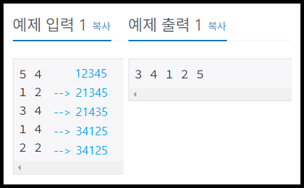
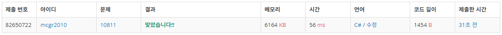

## 백준 > 04. 1차원 배열 > 09번. 바구니 뒤집기    
문제번호: [10811](https://www.acmicpc.net/problem/10811), &nbsp; 시간제한: 1초, &nbsp; 메모리제한: 256MB

### 목표     
> 1    

### 예시


<br>

### 작성한 코드   

```cs
// N개의 바구니를 왼쪽부터 1~N 순서로 놓고, 순서 변경을 M번 시도한다.
// i부터 j까지의 바구니 내용물을 순서를 역순으로 취한다면, 이때의 출력값은?

using System;

class Program
{
    static void Main(string[] args)
    {        
        string[] input = Console.ReadLine().Split();
        int N = int.Parse(input[0]);
        int M = int.Parse(input[1]);

        int[] nArr = new int[N];
        int[] nCopy = new int[N];

        // 배열 nArr에 1부터 N까지 내용 초기화
        for(int nInput = 0; nInput<N; nInput++)
        {
            nArr[nInput] = nInput + 1;
        }


        // i와 j값을 M번 반복해서 입력받기
        for (int nTry = 1; nTry <= M; nTry++)
        {

            // 기존 배열 nArr 내용을 nCopy에 복사해두기
            Array.Copy(nArr, nCopy, N);          
            
            input = Console.ReadLine().Split();
            int i = int.Parse(input[0]) - 1; // 0
            int j = int.Parse(input[1]) - 1; // 3

            //범위 안의 내용을 역순으로 돌린다는 내용
            for (int nChange = j; nChange >= i; nChange--)
            {
                // 기존 배열에서는 0 1 2 3번째에 1 2 3 4가 들어있지만,
                // 새로운 배열에는 for문을 j부터 i까지 돌리면 
                // 새로운 배열에는 3 2 1 0번째에 4 3 2 1이 들어간다고 판단
                // 이러면 따로 건들지 않은 부분은 기존부분이 그대로 담겨있을 것임

                nCopy[c] = nArr[a];
                c -= 1;
                a += 1;
            }

            // 앞의 내용을 기반으로 nCopy 내용을 nArr에 저장하기
            Array.Copy(nCopy, nArr, N);

        }

        foreach(int num in nCopy)
        {
            Console.Write($"{num} "); //정상: 3 4 1 2 5
        }

    }
    
}
```

<br>

### 결과    

