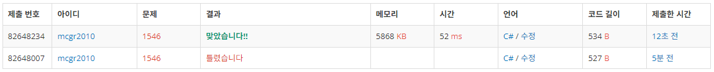

## 백준 > 04. 1차원 배열 > 10번. 평균  &nbsp; `[스페셜 저지 문제]`       
문제번호: [1546](https://www.acmicpc.net/problem/1546), &nbsp; 시간제한: 2초, &nbsp; 메모리제한: 128MB

### 목표     
> 자료형이 다른 계산도 수행할 수 있다.    
> c#의 배열

<br>

### 작성한 코드   

```cs
// 첫째 줄에 시험 본 과목의 개수 N
// 둘쨰 줄에 0 <= 값 <= 100이 주어지고, 이중에서 적어도 하나의 값은 0보다 크다.
// 자기 점수 중에 최댓값을 M으로 놓고, 모든 점수를 점수/M*100으로 계산한 새로운 평균을 구해라.
// 3과목, 40 80 60 입력시 --> 점수 보정해서 50 100 75점으로 보정되어 새로운 평균은 225/3인 75가 된다.

using System;

class Program
{
    static void Main(string[] args)
    {        
        //N과 정수형배열[N] 초기화하기
        int N = int.Parse(Console.ReadLine());
        int[] nInput = new int[N];
        string[] stInput = Console.ReadLine().Split();

        for (int i = 0; i < N; i++)
        {
            nInput[i] = int.Parse(stInput[i]);
        }

        // 가장 큰 값을 맨 뒤로 보내서 M에 넣기
        Array.Sort(nInput);
        int M = nInput[N - 1];

        float fSum = 0f;
        float fResult = 0f;

        //의도대로 계산한값을 fSum에 넣고 fResult에 더해주기
        for (int i = 0; i < N; i++)
        {
            fSum = (float)nInput[i] / M;
            fSum *= 100;
            fResult += fSum;
        }

        //누적된 값을 N개로 나눠주고 출력하기
        fResult /= N;
        Console.WriteLine(fResult);

    }
    
}
```

<br>

### 결과    
: float와 int형 사이의 계산에서 형변환을 하지 않아서 오류가 나왔다.

