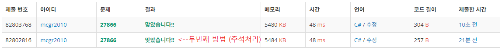

## 백준 > 05. 문자열 > 01번. 문자와 문자열    
문제번호: [27866](https://www.acmicpc.net/problem/27866), &nbsp; 시간제한: 1초, &nbsp; 메모리제한: 1024MB

### 목표     
> 문자열을 문자로 나눌 수 있다.    
> Parse()와 TryParse()를 쓰임에 따라 사용할 수 있다. 

<br>

### 작성한 코드   

```cs
// 단어 S와 정수 i가 주어졌을때, S의 i번째 글자를 출력하라

using System;

class Program
{
    static void Main(string[] args)
    {        

        string input = Console.ReadLine();

        if(int.TryParse(Console.ReadLine(), out int N))
        {
            Console.WriteLine(input[N - 1]);
        }

        // 두번째 방법
        //
        //string S = Console.ReadLine()!;
        //int i = int.Parse(Console.ReadLine()!);
        //
        //Console.WriteLine(S[i - 1]);

    }
    
}
```

<br>

### 결과    
: Split()은 공백이나 ,등의 문자를 기준으로 나누기 때문에 해결할 수 없어서 인터넷을 참고하였다.    
두번째 방법으로 푸는법이 나왔지만 아직 이해하지 못했다..&nbsp; (추후 수정필요) &nbsp; [▶ 참고한 코드](https://soo-bak.github.io/algorithm/boj/CharAndString/#google_vignette), &nbsp; [▶ 단항 후위 ! 연산자(MSDN)](https://learn.microsoft.com/ko-kr/dotnet/csharp/language-reference/operators/null-forgiving)     
이후 TryParse()를 이용해서 해결하였다.

