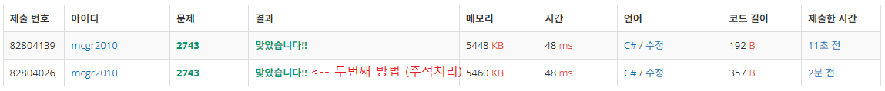

## 백준 > 05. 문자열 > 02번. 단어 길이 재기    
문제번호: [2743](https://www.acmicpc.net/problem/2743), &nbsp; 시간제한: 1초, &nbsp; 메모리제한: 128MB

### 목표     
> C#에서 제공하는 프로퍼티를 이용할 수 있다.    
> 문자열의 크기를 알아내는 Length기능을 이용해본다.

<br>

### 작성한 코드   

```cs
// 알파벳으로만 이루어진 단어를 입력받아, 그 길이를 출력하는 프로그램을 작성하시오.

using System;

class Program
{
    static void Main(string[] args)
    {        
        //string의 길이를 알아오는 Length기능 이용하기
        string stInput = Console.ReadLine();
        Console.WriteLine(stInput.Length);

        // 두번째 방법
        //
        //string input = Console.ReadLine();
        //
        //if(int.TryParse(Console.ReadLine(), out int N))
        //{
        //    Console.WriteLine(input[N - 1]);
        //}

    }
    
}
```

<br>

### 결과    
: 실수로 이전 문항의 코드를 복붙하였는데, 맞았다고 나온 이유를 잘 모르겠다..&nbsp; (추후 수정필요)

