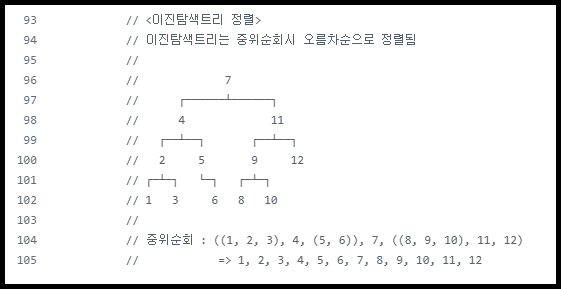

## 심화 과제 1. 이진탐색트리

### `- 개념`    
비선형 자료구조중 트리의 일종으로,    
각각의 노드가 자식노드를 최대 2개까지밖에 가지지 못하는 트리이다.

루트 노드를 중심으로 왼쪽과 오른쪽의 서브트리들도 모두 이진탐색트리를 구성하고 있으며 그래야 한다.   
루트 노드의 왼쪽엔 루트노드보다 작은 값만, 오른쪽엔 큰 값만 들어올 수 있고 이를 어기면 이진탐색트리가 아니다.    
따라서 트리의 깊이와 관계없이 가장 왼쪽 끝에 최소값이, 가장 오른쪽 끝에 최대값이 위치한다.

 

### `- 구조`     
- 편향 이진트리 :&nbsp; 이진탐색트리가 한쪽으로만 뻗어있는 경우         
- 포화 이진트리 :&nbsp; 모든 세대와 자식이 꽉 차있는 경우     
- 완전 이진트리 :&nbsp; 두 경우가 아닐 경우

 

### `- 구현원리`    
루트 노드의 왼쪽엔 루트노드보다 작은 값만 들어있고, 오른쪽엔 루트보다 큰 값만 들어있으며    
트리의 깊이가 깊어져도 이 점이 여전하다는 특성을 이용하여 데이터의 탐색, 삽입, 삭제가 가능하다.

 

### `- 삽입 & 삭제 & 탐색 과정`

- 탐색: 루트 노드 r부터 시작하여 탐색하려는 값 k와 비교,    
 r>k면 왼쪽 자식노드로 이동, r<k면 오른쪽 자식노드로 이동을 끊임없이 반복하여 탐색한다.

- 삽입: 루트 노드 r부터 시작하여 탐색하려는 값 b와 비교,     
 r>b면 왼쪽 자식노드로 이동, r<b면 오른쪽 자식노드로 이동을 끊임없이 반복하다가 빈 공간을 찾으면 삽입한다.

- 삭제:      
-- 자식이 0개인 경우:&nbsp; 단순 삭제 진행     
-- 자식이 1개인 경우:&nbsp; 삭제하는 노드의 부모와 자식을 연결 후 삭제     
-- 자식이 2개인 경우:&nbsp; 삭제하는 노드를 기준으로 오른쪽자식 중 가장 작은 값 노드와 교체 후 삭제

 

### `- 전위순회, 중위순회, 후위순회` &nbsp; (정렬이 보장되는 순회방식은?)

- 전위순회:&nbsp; 뿌리 -> 왼쪽자식 -> 오른쪽자식 순서로 순회하는것. (DFS 탐색 알고리즘과 같음)    
 ㄴ 위 코드에서는 7 4 2 1 3 5 6 11 9 8 10 12 순서로 출력된다.

- 중위순회:&nbsp; 왼쪽자식 -> 뿌리 -> 오른쪽자식 순서로 순회하는것.    
 ㄴ 위 코드에서는 1 2 3 4 5 6 7 8 9 10 11 12 순서로 출력된다. (오름차순으로 정렬이 보장됨)

- 후위순회:&nbsp; 왼쪽자식 -> 오른쪽자식 -> 뿌리 순서로 순회하는것.    
 ㄴ 위 코드에서는 1 3 2 6 5 4 8 10 9 12 11 7 순서로 출력된다.

- 외에도 층별순회(BFS탐색)가 있다. &nbsp; (7 4 11 2 5 9 12 1 3 6 8 10 순서로 출력됨)

 

### `- 불균형 문제와 해결법`    

- 불균형:    
이진탐색트리는 최악의 경우, 노드들이 한쪽 자식으로만 추가되는 불균형 현상이 발생할 수 있다.    
편향이진트리의 모습이 이진탐색트리 불균형의 예시가 될 수 있다.

- 해결법:    
불균형을 막기 위해 "자가균형기능"을 추가한 트리를 사용하는것이 일반적이다.    
(자가균형트리는 회전을 이용하여 불균형이 있는 상황을 해결하는 트리이다.)    
대표적인 방식으로 Red-Black Tree, AVL Tree 등을 통해 불균형상황을 파악한다.   

 
 
 

----

**▶참고가 된 게시글**    
▷[개념&코드](https://github.com/jungtaek6681/CSharp-Algorithm/blob/master/05.%20BinarySearchTree/Program.cs)     &nbsp; ▷[구조](https://velog.io/@letskuku/%EC%9E%90%EB%A3%8C%EA%B5%AC%EC%A1%B0-%EC%9D%B4%EC%A7%84%ED%8A%B8%EB%A6%AC%EC%99%80-%EC%9D%B4%EC%A7%84%ED%83%90%EC%83%89%ED%8A%B8%EB%A6%AC)    &nbsp; ▷[순회](https://m.blog.naver.com/rlakk11/60159303809)